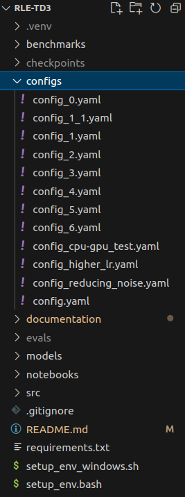

# RLE-TD3
This repository is part of lectures "Robot programming" from Prof. Dr.-Ing. Björn Hein at University of Applied Science Karlsruhe. <br>
It contains the implemementation of the TD3 Reinforcment learning algorithm by Eshan Savla, Raphael Aberle and Leo Schäfer. <br>


The models were trained and tested using the Ant-v3 environment from mujoco using [OpenAI's Gymnasiums](https://gymnasium.farama.org/index.html).

## I. Setting up the environement and installing dependencies

#### Setting up the python virtual environement under ubuntu:
1. To create a virtual environement and install all necessary python packages run
```
./setup_env.bash
```

1. Alternatively, you can source the script to activate the environment in your current terminal
```
source setup_env.bash
```
2. Install the mujoco environement necessary for training, testing and visualizing results:
```
cd ~
wget https://mujoco.org/download/mujoco210-linux-x86_64.tar.gz
tar -xzf mujoco210-linux-x86_64.tar
mkdir -p ~/.mujoco
mv ~/mujoco210 ~/.mujoco/mujoco210
echo "export LD_LIBRARY_PATH=$LD_LIBRARY_PATH:$HOME/.mujoco/mujoco210/bin" >> $HOME/.bashrc
```

### Training an Agent
To manage configs we use [Hydra](https://hydra.cc/) and YAML files.

1. Use an exisiting config file or create your own with different hyperparameters in the **configs** folder



2. Adjust the *config_name* in the file *td3_config* under **src** to match your chosen config

3. Use the *main* function in *main_td3* to begin the training of your agent. <br> If you are continuing training of a pretrained agent, use the flag *load_replay_buffer* to load your presaved replay_buffer if required.

    **NOTE:** Using a saved replay buffer is not necessary for continuing training. <br> It is recommended then to let the agent explore for at least 10,000 Steps before beginning training

1. Performance of the training (actor and critic losses) are recorded and saved under the directory **evals**. This folder is created automatically in the root of the repository.

## II. Evaluating and visualizing trained models

1. Select the config in *td3_config* you used to train the model

2. Use the *main* function in *enjoy.py* to visualize and evaluate your trained model. The function takes two arguments - the *agent_type* and and optional *render_mode* . For a td3 agent, use *"td3"*. Render mode *"human"* visualizes in 3D environment.

```
main(agent_type="td3", render_mode="human")
```

3. The average return and standard deviations are returned and saved under a benchmarks csv file in the repository root and can be utilized to plot results.
